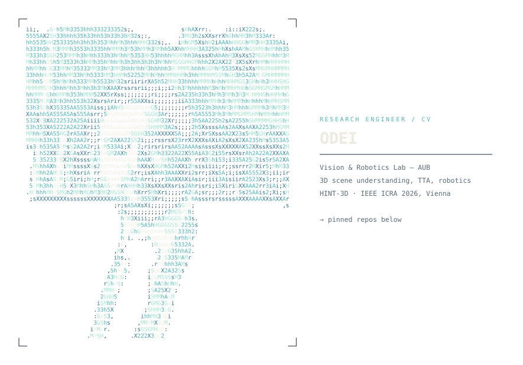

<picture>
  <source media="(prefers-color-scheme: dark)" srcset="hero-dark-transparent.svg">
  <source media="(prefers-color-scheme: light)" srcset="hero-light-transparent.svg">
  
</picture>

I work on 3D scene understanding — point cloud segmentation, test-time adaptation, and keeping humans usefully in the loop when models drift.

Currently at AUB's **Vision & Robotics Lab**, where I build urban digital twins for **DIDYMOS-XR** (Horizon Europe). My first-author work, **HINT-3D**, was presented at **IEEE ICRA 2026** in Vienna: interactive 3D segmentation that adapts from sparse human corrections instead of retraining from scratch.

On the side I'm CTO of **BullsAI**, where the computer vision has to survive contact with reality on a Jetson.

Heading toward a PhD in 3D perception. Open to collaborations on adaptation, interactive segmentation, and anything involving point clouds behaving badly.

### Selected work

**HINT-3D** — Human-in-the-loop 3D segmentation with test-time adaptation.
Sparse corrections from an annotator steer the model at inference; no retraining pass.
*IEEE ICRA 2026, Vienna.*

**DIDYMOS-XR** — Horizon Europe project on 3D urban digital twins.
Point cloud segmentation at city scale, benchmarked against PTv3, Sonata, KPConv, and RandLA-Net.

**BullsAI** — Computer vision for marksmanship analytics.
Detection and tracking under overlap and clutter, deployed on Jetson and Raspberry Pi.

### Stack

PyTorch · Open3D · Pointcept · CUDA · ONNX / TensorRT · Docker · C

### Elsewhere

- Vision & Robotics Lab, American University of Beirut
- École 42 Beirut
- Reach me at `<your-email>`
